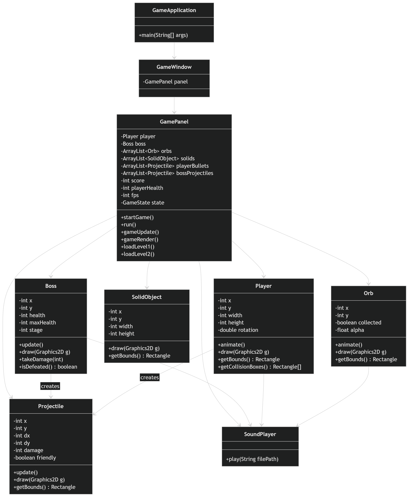

# GalacticOrbHunter
2D Java Video Game

Report – Galactic Orb Hunter
Mikel Maharaj Comp 3609 Project
Video Demonstration: CLICK HERE TO GO TO YOUTUBE VIDEO!
1. Introduction
Galactic Orb Hunter is a 2D space-based game developed using Java
and object-oriented programming principles. The game builds upon
earlier assignment 2 and extends it into a complete multi-level
experience featuring exploration, obstacle interaction, and a boss
battle.
The game demonstrates key concepts such as sprite animation,
collision detection, image effects, sound integration, and
structured object-oriented design.
2. Game Concept
The game is set in space where the player controls a spaceship
navigating through a hazardous environment.
The core concept is divided into two stages:
• Level 1: Collect energy orbs to power the spaceship
• Level 2: Use the collected energy to engage in a boss battle
The transition between levels creates a sense of progression from
exploration to combat.
3. How to Play
Controls
• W / Arrow Up – Move Up
• S / Arrow Down – Move Down
• A / Arrow Left – Move Left
• D / Arrow Right – Move Right
• Spacebar – Shoot (Level 2 only)
• R – Restart game (after death or victory)
Level 1 – Orb Collection
• The player navigates a large scrolling space environment.
• The objective is to collect a required number of energy orbs.
• Each orb collected:
o Awards 100 points
o Plays a sound effect
o Triggers a fade animation
• The environment contains solid rock obstacles:
o The player cannot pass through them
o Collision causes damage and a red tint effect
• Once all orbs are collected, the game transitions to Level 2.
Level 2 – Boss Battle
• The player enters a combat arena.
• A boss appears at the top of the screen and moves
horizontally.
• The player can now shoot projectiles using the spacebar.
• Both the player and boss have health bars.
Boss Behaviour:
The boss has three stages based on its remaining health:
• Stage 1: Slow movement with simple attacks
• Stage 2: Faster movement with spread attacks
• Stage 3: Fast and aggressive with multiple projectile
patterns
Win/Loss Conditions:
• Win: Boss health reaches zero → Victory screen
• Lose: Player health reaches zero → Game restarts from Level 1
4. Implemented Features
The game includes the following features:
• Large scrolling background environment
• Player sprite animation and rotation
• Randomly generated collectible items (orbs)
• Solid object collision using sub-hitboxes
• Smooth movement and camera tracking
• Two-level progression system
• Boss AI with multiple attack patterns
• Projectile system for both the player and boss
• Image effects:
o Fade effect (orb collection)
o Red tint effect (damage)
o Grayscale effect (game over)
• Sound effects for interactions and events
• Manual double buffering for smooth rendering
• FPS counter and on-screen information display

5. Object-Oriented Design
The game follows an object-oriented architecture where each major
component is represented as a class with specific
responsibilities.
Core Classes
• GameApplication – Entry point of the program
• GameWindow – Creates and manages the application window
• GamePanel – Main game loop, rendering, and logic controller
Entity Classes
• Player – Handles movement, animation, rotation, and shooting
• Orb – Represents collectible items with animation and fade
effect
• SolidObject – Represents obstacles that block player movement
• Boss – Implements enemy behavior, movement, attack patterns,
and stages
• Projectile – Handles movement, collision, and damage of all
projectiles
Utility Classes
• SoundPlayer – Plays sound effects used throughout the game
Assets and Entities:
Background of Game
Player Spaceship
Orbs
Stage 1 Stage 2
Stage 3
Boss to Defeat
Rocks (Solid Object)
Sounds:
bossDefeat.wav bossHit.wav bossShoot.wav levelup.wav orb.wav playerShoot.wav
GameApplication
+main(String[] args)
GameWindow
-GamePanel panel
GamePanel
-Player player
-Boss boss
-ArrayList<Orb> orbs
-ArrayList<SolidObject> solids
-ArrayList<Projectile> playerBullets
-ArrayList<Projectile> bossProjectiles
-int score
-int playerHealth
-int fps
-GameState state
+startGame()
+run()
+gameUpdate()
+gameRender()
+loadLevel1()
+loadLevel2()
Boss Player
Orb SolidObject -int x -int x
-int y
-int y
-int x
-int health -int width -int y
-int maxHealth -int width -int stage -int height
+update()
+draw(Graphics2D g)
+takeDamage(int)
+isDefeated() : boolean
+draw(Graphics2D g)
+getBounds() : Rectangle
-int height
-double rotation
+animate()
+draw(Graphics2D g)
+getBounds() : Rectangle
+getCollisionBoxes() : Rectangle[]
-int x
-int y
-boolean collected
-float alpha
+animate()
+draw(Graphics2D g)
+getBounds() : Rectangle
creates
Projectile
-int x
-int y
-int dx
-int dy
-int damage
-boolean friendly
+update()
+draw(Graphics2D g)
+getBounds() : Rectangle
creates
SoundPlayer
+play(String filePath)
Sources:
All assets (images, sounds) are sourced from OpenGameArt.
OpenGameArt: https://opengameart.org/
Code References:
• Comp 3609 Class notes - The University of the West Indies.
• Oracle Java Documentation – Graphics2D and KeyListener.
• Stack Overflow – Collision detection and ArrayList handling.
• ChatGPT (OpenAI) – Assistance with game logic, debugging, and
feature implementation.
Note:
Project Folder Structure
The project is organized into multiple folders to separate code
and resources:
• src/
Contains all Java source files, including:
o GameApplication – Entry point.
o GameWindow – Window setup.
o GamePanel – Game loop and logic.
o Entity classes such as Player, Boss, Orb, Projectile,
and SolidObject.
• assets/
Contains all game resources:
o Images (player, background, rocks, orbs, boss)
o Sound clips (shooting, collection, effects)
• out/ (or build folder)
Contains compiled .class files generated by the IDE used.
Video link just incase: https://youtu.be/y2VF8-NzshQ
